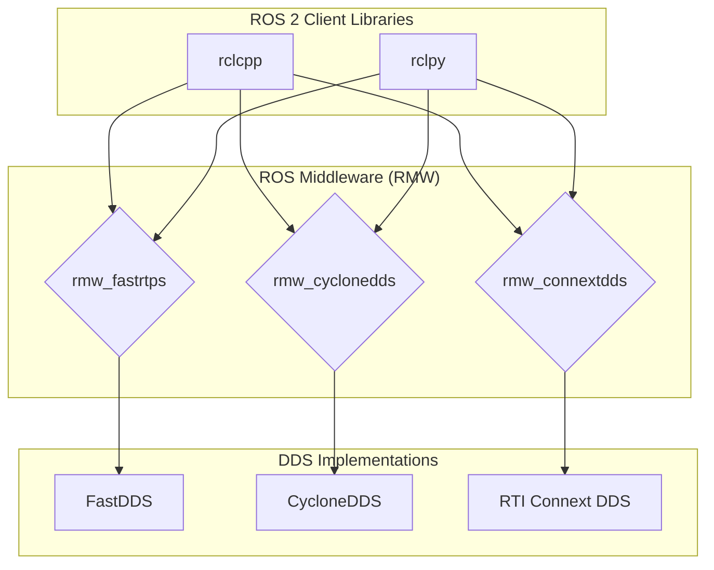

# ROS 2 Architecture

This week, we'll explore the fundamental architecture of ROS 2 and understand how it differs from ROS 1. The architecture is designed to be more robust, secure, and suitable for real-world applications.

## Learning Objectives

After completing this week, you will be able to:

- Explain the key components of ROS 2 architecture
- Understand the DDS (Data Distribution Service) layer
- Identify the differences between ROS 1 and ROS 2 architecture

## Introduction to ROS 2 Architecture

ROS 2 is built on a client library architecture that uses DDS (Data Distribution Service) as the middleware. This is a significant change from ROS 1, which used a centralized master architecture.

### Key Components

1. **Nodes**: The fundamental unit of computation in ROS 2
2. **DDS/RMW**: The middleware that handles communication
3. **Client Libraries**: rclcpp (C++) and rclpy (Python)
4. **ROS Middleware (RMW)**: Abstraction layer between client libraries and DDS implementations

## DDS - Data Distribution Service

DDS is a specification for machine-to-machine connectivity that provides a publish-subscribe model for data exchange. It offers:

- **Real-time performance**: Deterministic behavior for time-critical applications
- **Reliability**: Quality of Service (QoS) policies for different communication needs
- **Scalability**: Ability to handle large networks with many participants
- **Security**: Built-in security features for safe communication



## Quality of Service (QoS) Policies

QoS policies allow you to configure how messages are delivered between nodes. Key policies include:

- **Reliability**: Reliable vs. Best Effort
- **Durability**: Transient Local vs. Volatile
- **History**: Keep All vs. Keep Last
- **Deadline**: Maximum time between consecutive messages

import Exercise from '@site/src/components/Exercise';

<!-- Instructor Notes:
- Students often struggle with the concept of DDS and middleware abstraction
- Emphasize the differences from ROS 1's master-based architecture
- Provide visual aids to explain the client library and RMW layers
- Consider having students compare ROS 1 and ROS 2 architectures side by side
- Be prepared to explain QoS policies in more detail for advanced students
-->

<Exercise
  title="Exploring ROS 2 Architecture"
  difficulty="beginner"
  estimatedTime={30}
  type="practical"
>

Try running the following commands to explore your ROS 2 installation:

```bash
# Check available DDS implementations
ls /opt/ros/humble/lib/
# Or on Windows with ROS 2 installed
ros2 doctor
```

Then run a simple example to see nodes in action:

```bash
# Terminal 1
ros2 run demo_nodes_cpp talker

# Terminal 2
ros2 run demo_nodes_py listener
```

</Exercise>

## Summary

ROS 2's architecture with DDS provides a more robust and scalable foundation for robotics applications. The middleware abstraction layer allows for flexibility in choosing different DDS implementations based on your specific needs.

## Next Steps

[Continue to Week 4: ROS 2 Nodes, Topics, and Services](../week-4/nodes-topics-services)