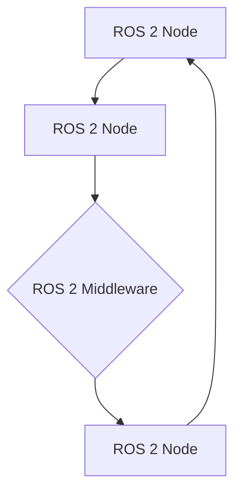

# Quickstart Guide: Physical AI & Humanoid Robotics Textbook

## Prerequisites

Before starting with the Physical AI & Humanoid Robotics textbook project, ensure you have the following installed:

- **Node.js** (version 18.0 or higher)
- **npm** or **yarn** package manager
- **Git** for version control
- A modern web browser for previewing the site

## Setting Up the Development Environment

### 1. Clone the Repository
```bash
git clone <repository-url>
cd physical-ai-textbook
```

### 2. Navigate to the Docusaurus Project
```bash
cd my-website
```

### 3. Install Dependencies
```bash
npm install
# or
yarn install
```

### 4. Start the Development Server
```bash
npm run start
# or
yarn start
```

This will start a local development server at `http://localhost:3000` with hot reloading enabled.

## Project Structure Overview

The textbook content is organized as follows:

```
my-website/
├── docs/                      # Textbook content by modules and weeks
│   ├── module-1/              # ROS 2 content
│   │   ├── week-3/
│   │   ├── week-4/
│   │   └── week-5/
│   ├── module-2/              # Gazebo & Unity content
│   │   ├── week-6/
│   │   └── week-7/
│   ├── module-3/              # NVIDIA Isaac content
│   │   ├── week-8/
│   │   ├── week-9/
│   │   └── week-10/
│   └── module-4/              # VLA content
│       ├── week-11/
│       ├── week-12/
│       └── week-13/
├── src/
│   ├── components/            # Custom React components
│   └── pages/                 # Additional pages
├── static/                    # Images, diagrams, and assets
└── docusaurus.config.js       # Main configuration
```

## Adding New Content

### Creating a New Week's Content

1. Navigate to the appropriate module directory:
```bash
cd docs/module-1/  # For ROS 2 content
```

2. Create a new MDX file for the week:
```bash
touch week-3/introduction-to-nodes.mdx
```

3. Add the following frontmatter to your MDX file:
```md
---
title: Introduction to ROS 2 Nodes
description: Learn about the fundamental building blocks of ROS 2 systems
sidebar_position: 1
---

# Introduction to ROS 2 Nodes

Content goes here...
```

### Adding Code Examples

Use Docusaurus' built-in code block syntax with language specification:

```md
import Tabs from '@theme/Tabs';
import TabItem from '@theme/TabItem';

<Tabs>
<TabItem value="python" label="Python">
```python
import rclpy
from rclpy.node import Node

class MinimalPublisher(Node):
    def __init__(self):
        super().__init__('minimal_publisher')
        self.publisher = self.create_publisher(String, 'topic', 10)
```
</TabItem>
<TabItem value="cpp" label="C++">
```cpp
#include <rclcpp/rclcpp.hpp>

class MinimalPublisher : public rclcpp::Node
{
public:
  MinimalPublisher() : Node("minimal_publisher") {
    publisher_ = this->create_publisher<std_msgs::msg::String>("topic", 10);
  }
```
</TabItem>
</Tabs>
```

### Adding Diagrams

Use Mermaid syntax for architecture diagrams:

````md

````

## Custom Components

### Exercise Component
Create interactive exercises using the custom Exercise component:

```mdx
import Exercise from '@site/src/components/Exercise';

<Exercise
  title="Create Your First Node"
  difficulty="beginner"
  estimatedTime={30}
  description="Create a simple ROS 2 node that publishes a message to a topic."
>

#### Instructions
1. Create a new Python file called `my_node.py`
2. Import the necessary ROS 2 libraries
3. Create a node class that inherits from `Node`
4. Implement the constructor and add basic functionality

#### Solution
```python
# Your solution code here
```

</Exercise>
```

### Diagram Component
Use the Diagram component for complex visualizations:

```mdx
import Diagram from '@site/src/components/Diagram';

<Diagram
  title="ROS 2 Architecture Overview"
  description="Shows the relationship between nodes, topics, and services"
>
{/* Diagram content */}
</Diagram>
```

## Building for Production

To build the static site for deployment:

```bash
npm run build
# or
yarn build
```

The built site will be available in the `build/` directory.

## Deployment

The site is configured for GitHub Pages deployment. To deploy:

1. Ensure your GitHub repository is set up with GitHub Pages
2. Push your changes to the main branch
3. The GitHub Actions workflow will automatically build and deploy the site

Alternatively, you can manually deploy the contents of the `build/` directory to your web server.

## Configuration

### Site Configuration
Edit `docusaurus.config.js` to modify site-wide settings:

- Site title and description
- Navigation sidebar
- Algolia search configuration
- Theme settings

### Navigation
Edit `sidebars.js` to update the navigation structure and content hierarchy.

## Useful Commands

- `npm start` - Start local development server
- `npm run build` - Build static site for production
- `npm run serve` - Serve the built site locally for testing
- `npm run deploy` - Deploy to GitHub Pages (if configured)

## Troubleshooting

### Common Issues

1. **Page not loading after changes**: Clear browser cache or do a hard refresh (Ctrl+F5)

2. **Code blocks not highlighting**: Ensure proper language specification after the opening triple backticks

3. **Images not showing**: Place images in the `static/img/` directory and reference with `/img/image-name.jpg`

4. **Build errors**: Run `npm run clear` to clear Docusaurus cache and try building again

For additional help, refer to the [Docusaurus documentation](https://docusaurus.io/docs) or create an issue in the repository.